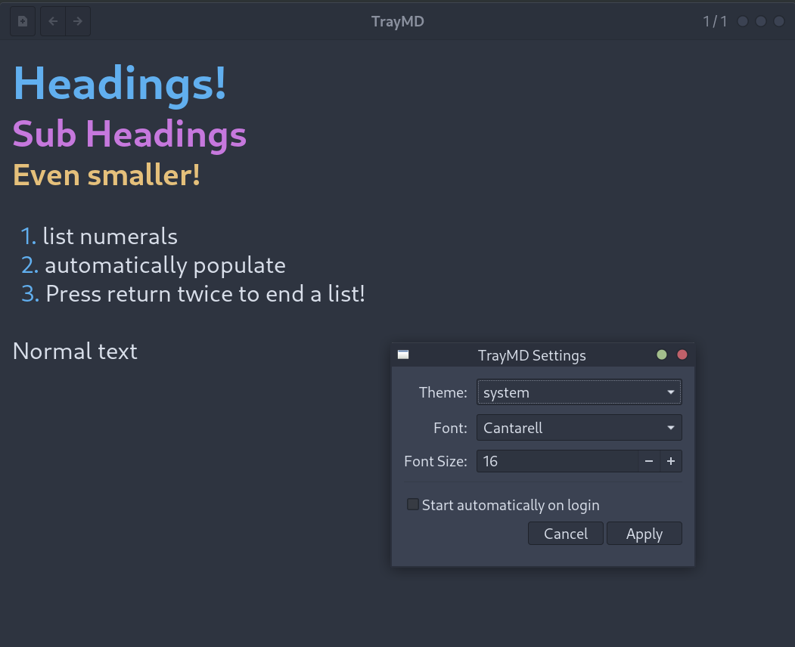

# TrayMD

A lightweight GTK 3 markdown notes application for Linux system trays.



## Features

- **Live in-place markdown rendering** - See formatting as you type
- **System tray integration** - Quick access from your window manager
- **Auto-save** - Notes are saved automatically (500ms after last keystroke)
- **Minimal UI** - Clean toolbar with new note and navigation buttons
- **Lightweight** - Pure C, no web technologies, fast startup

## Supported Markdown

| Syntax | Description |
|--------|-------------|
| `# Header 1` | Large bold header |
| `## Header 2` | Medium bold header |
| `### Header 3` | Small bold header |
| `**bold**` | Bold text |
| `*italic*` | Italic text |
| `` `code` `` | Inline code |
| `- item` | List item |
| `> quote` | Block quote |
| `[text](url)` | Link |
| `---` | Horizontal rule |

## Dependencies

### Arch Linux
```bash
sudo pacman -S gtk3 libayatana-appindicator
```

### Ubuntu/Debian
```bash
sudo apt install libgtk-3-dev libayatana-appindicator3-dev
```

### Fedora
```bash
sudo dnf install gtk3-devel libayatana-appindicator-gtk3-devel
```

## Building

```bash
make
```

## Installation

```bash
sudo make install
```

This installs:
- Binary to `/usr/local/bin/traymd`
- Desktop file to `/usr/local/share/applications/traymd.desktop`

## Uninstallation

```bash
sudo make uninstall
```

## Usage

Run `traymd` to start the application. It will appear in your system tray.

- **Left-click tray icon**: Show/hide the main window
- **New Note button**: Create a new note
- **Arrow buttons**: Navigate between notes

If your desktop environment forces a context menu on left-click (common with
AppIndicator-based trays), you can switch tray backends:

- `traymd --tray-backend=statusicon` (left-click toggles window)
- `traymd --tray-backend=appindicator` (menu-first behavior; middle-click toggles)

Notes are stored in `~/.local/share/traymd/notes/` as plain markdown files (and
your existing `markyd` data is migrated automatically on startup).

## License

MIT License
